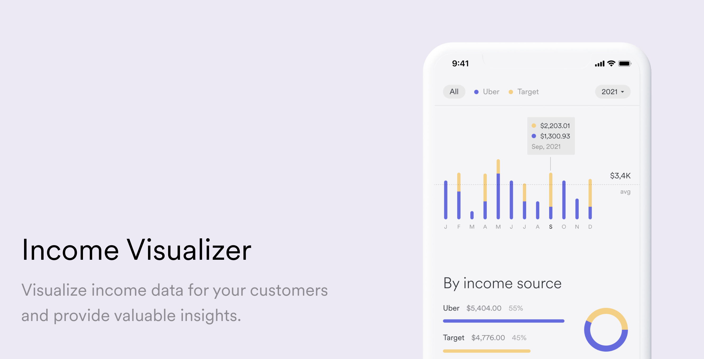

# Income Visualizer



Income visualizer offers a centralized dashboard that consolidates users’ income data from many different sources and presents it in intuitive, customizable charts and displays. This gives users valuable insights into their income—like the wages they’ve earned versus received, how earnings from different income streams compare, or how their income breaks down by the day, week, month, or year.

You can try out the Income Visualizer demo [here](https://sampleapps.argyle.com/income-visualizer) and learn more about the features [here](https://docs.argyle.com/guides/docs/income-visualizer).

## Getting Started

1. Rename `env.example` to `.env` and fill in Argyle related keys from your https://console.argyle.com account. Do the same for Unit.

2. Install the dependencies

```bash
npm install
# or
yarn install
```

3. Run the development server:

```bash
npm run dev
# or
yarn dev
```

4. Open [http://localhost:3000/income-visualizer](http://localhost:3000) with your browser to see the result.

## Prerequisites

- [Argyle Account](https://console.argyle.com/sign-up)

## Learn More

To learn more, take a look at the following resources:

- [Next.js Documentation](https://nextjs.org/docs) - learn about Next.js features and API.
- [Argyle Docs](https://argyle.com/docs) - learn about Argyle integration
